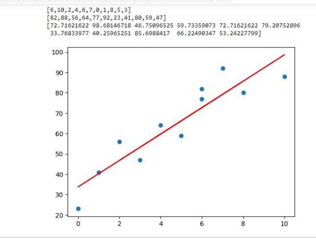

# Implementation of Univariate Linear Regression
## AIM:
To implement univariate Linear Regression to fit a straight line using least squares.

## Equipments Required:
1. Hardware – PCs
2. Anaconda – Python 3.7 Installation / Jupyter notebook

## Algorithm
1. Get the independent variable X and dependent variable Y.
2. Calculate the mean of the X -values and the mean of the Y -values.
3. Find the slope m of the line of best fit using the formula. 

4. Compute the y -intercept of the line by using the formula:

5. Use the slope m and the y -intercept to form the equation of the line.
6. Obtain the straight line equation Y=mX+b and plot the scatterplot.

## Program:
```
/*
Program to implement univariate Linear Regression to fit a straight line using least squares.
Developed by: Meyyappan.T
RegisterNumber:  212223240086
import numpy as np
import matplotlib.pyplot as plt
X=np.array(eval(input()))
Y=np.array(eval(input()))
Xm=np.mean(X)
Ym=np.mean(Y)
num,denom=0,0
for i in range(len(X)):
    num+=(X[i]-Xm)*(Y[i]-Ym)
    denom+=(X[i]-Xm)**2
m=num/denom
b=Ym-m*Xm
Y_pred=m*X+b
print(Y_pred)
plt.scatter(X,Y)
plt.plot(X,Y_pred,color='red')
plt.show()
*/
```

## Output:





## Result:
Thus the univariate Linear Regression was implemented to fit a straight line using least squares using python programming.
